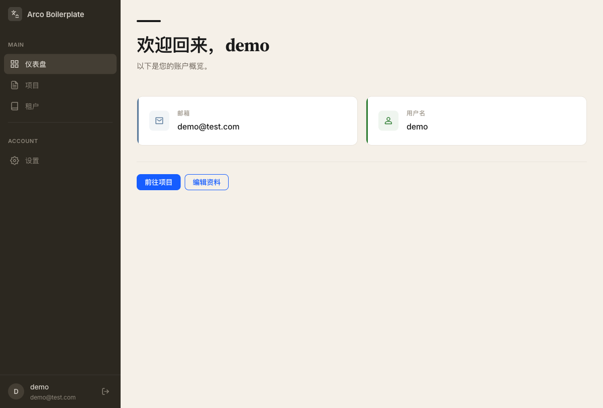
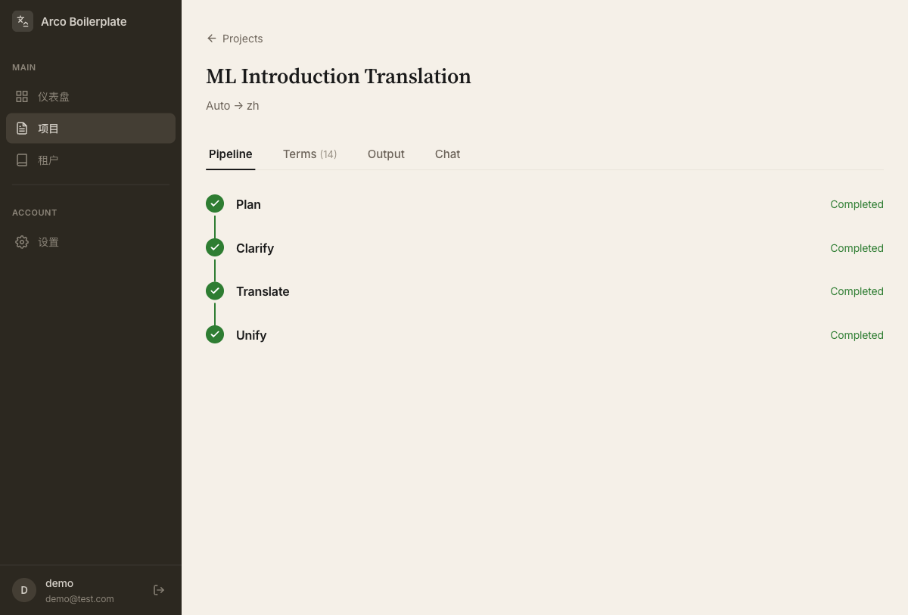
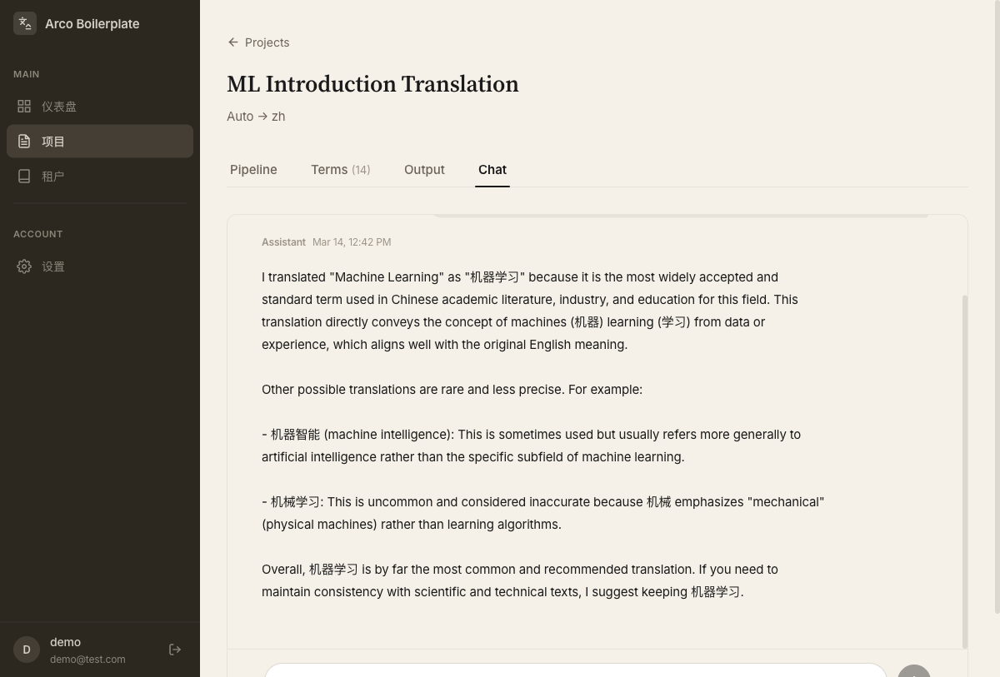

# Translator Agent

**Translate documents intelligently** -- upload any document, get a polished translation with automatic term management, and refine results through a built-in chat assistant.

[](LICENSE)
[](https://github.com/orgs/AIP-PUB/)

---

## Features

- **Multi-format document support** -- Upload plain text, Markdown, PDF, DOCX, or HTML files and receive structured Markdown output with optional PDF export.

- **Intelligent 4-stage pipeline** -- Documents flow through Plan, Clarify, Translate, and Unify stages, each powered by LLM, with real-time progress tracking via WebSocket.

- **Automatic term management** -- Specialized terms are extracted automatically during the Clarify stage. Review, edit, and confirm translations before proceeding to ensure domain-accurate results.

- **Large document handling** -- Smart chunking splits large documents into manageable pieces while preserving cross-chunk context and terminology coherence.

- **Post-translation chat assistant** -- Ask questions about the translation, request alternative phrasings, or modify specific terms -- all within a conversational interface.

- **Any target language** -- Translate into any language supported by modern LLMs. Source language is auto-detected or manually specified.

- **ACPs-compliant** -- Discoverable and callable by other AI agents via the Agent Communication Protocol (ACPs v2.0.0), enabling automated translation workflows.

## Screenshots

| Dashboard | Project Detail | Chat Assistant |
|:-:|:-:|:-:|
|  |  |  |

## Quick Start

### Docker (recommended)

```bash
# Set your LLM API key
export LLM_API_KEY=your-api-key-here

# Start all services
docker compose up
```

| Service | URL |
|---------|-----|
| Frontend | http://localhost:3000 |
| Backend API | http://localhost:8000 |
| Swagger Docs | http://localhost:8000/docs |

### Local Development

**Prerequisites:** Docker & Docker Compose, Node.js 20+, Python 3.12+ with [uv](https://docs.astral.sh/uv/)

```bash
# 1. Start infrastructure (PostgreSQL, Redis, Kafka)
./scripts/start-dev.sh

# 2. Backend
cd backend
cp .env.example .env          # Edit with your LLM API key
uv sync
PYTHONPATH=src uv run alembic -c migration/alembic.ini upgrade head
PYTHONPATH=src uv run uvicorn main:app --reload --host 0.0.0.0 --port 8000

# 3. Frontend (in another terminal)
cd frontend
npm install
npm run dev

# 4. Worker (in another terminal)
cd backend
PYTHONPATH=src uv run python -m worker.run
```

### Run Tests

```bash
# Backend
cd backend && make test

# Frontend
cd frontend && npm run build
```

## Architecture

The system follows a modular monorepo structure with clear separation between backend and frontend.

**Backend** uses a 4-layer module pattern (Model, DTO, Service, Handler) with async I/O throughout. Long-running translation tasks are dispatched through Kafka and processed by dedicated workers. Real-time progress updates are pushed to the frontend via WebSocket + Redis Pub/Sub.

**Frontend** is a React SPA with Arco Design components, Zustand state management, and i18n support (English and Chinese).

For the full architecture and design decisions, see the [Design Document](docs/specs/2026-03-13-translator-agent-design.md).

## Tech Stack

| Layer | Technology |
|-------|-----------|
| Frontend | React 18, TypeScript, Vite, Arco Design, Zustand |
| Backend | FastAPI, SQLAlchemy (async), Pydantic |
| Database | PostgreSQL 16 |
| Cache | Redis 7 |
| Queue | Apache Kafka |
| LLM | LangChain + OpenAI-compatible API |
| Protocol | ACPs v2.0.0 |

## ACPs Compliance

Translator Agent implements the [Agent Communication Protocol](https://github.com/orgs/AIP-PUB/) (ACPs v2.0.0) as a Partner agent. This means other AI agents can discover and invoke translation capabilities programmatically, enabling automated document translation pipelines without human intervention.

## Contributing

1. Fork the repository
2. Create a feature branch (`git checkout -b feat/my-feature`)
3. Make your changes with tests
4. Run quality checks: `cd backend && make lint && make test` and `cd frontend && npm run lint && npm run build`
5. Open a pull request

## Credits

This project builds on:

- **Backend scaffold:** [fastapi-boilerplate](https://github.com/Momoyeyu/fastapi-boilerplate) -- Async FastAPI starter with auth, multi-tenancy, and Kafka
- **Frontend scaffold:** [arco-boilerplate](https://github.com/Momoyeyu/arco-boilerplate) -- React + Arco Design starter with i18n, theming, and auth flows
- **Protocol:** [ACPs v2.0.0](https://github.com/orgs/AIP-PUB/) -- Agent Communication Protocol specification

## License

[MIT](LICENSE)
